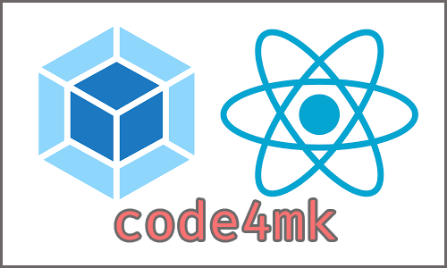

<p align="center" ></p>

# React-pack (webpack+react)

> A React project

## Build Setup

``` bash
#clone repo
git clone https://github.com/code4mk/webpack-react my-new-project

# install dependencies
npm install

or,

yarn install

# serve with hot reload at localhost:8080
npm run dev

# build for production with minification
npm run build
```

[]()
<a href="https://hellolaravel.org" >
<a href="https://twitter.com/code4mk" >
